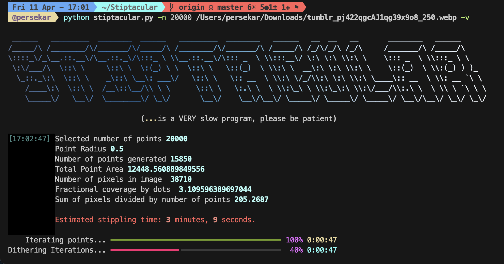
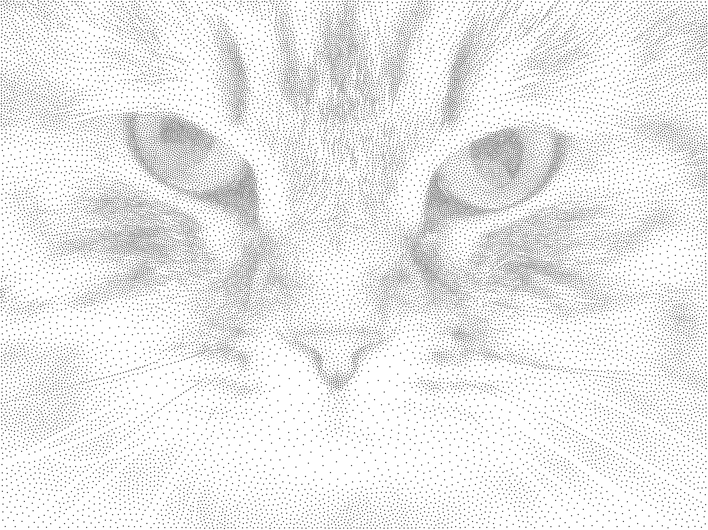

<!-- Improved compatibility of back to top link: See: https://github.com/othneildrew/Best-README-Template/pull/73 -->
<a id="readme-top"></a>
<!---->
[![Contributors][contributors-shield]][contributors-url]
[![Forks][forks-shield]][forks-url]
[![Stargazers][stars-shield]][stars-url]
[![Issues][issues-shield]][issues-url]
[![Unlicense License][license-shield]][license-url]

<br />
<div align="center">
  <h1 align="center">Stiptacular Next Gen</h3>

  <p align="center">
    Turn Images Into Stippled B&W
  </p>
</div>


<!-- ABOUT THE PROJECT -->


Remember how old scientific papers couldn't print in color in journals, so they did cool stippling and shit?

PERSEPHONE REMEMBERS

so anyway I found a project that converts images into stippled b&w and fixed it and am currently fixing it up to work with new versions of python + adding some features

<p align="right">(<a href="#readme-top">back to top</a>)</p>


<!-- GETTING STARTED -->
## Getting Started

### Installation

1. Clone the repo
   ```sh
   git clone --recursive https://github.com/pkarnstein-SI/Stiptacular.git
   ```
2. Install requirements
   ```sh
   python -m pip install -r requirements.txt
   ```
3. Run the setup script
   ```sh
   chmod +x setup.sh && ./setup.sh
   ```

<p align="right">(<a href="#readme-top">back to top</a>)</p>

<!-- USAGE EXAMPLES -->
## Usage



Will write this later when i'm back on adderall

<p align="right">(<a href="#readme-top">back to top</a>)</p>


## Training your own model

> [!NOTE] 
> These steps are automated by `setup.sh --train`; the steps below only need to be run manually if you want to change settings, or are running on a device (i.e., a macbook) that doesn't support CUDA

1. Download the fonts you want to train on, and text to train with (the wikipedia training dependency for `font-classify` hasn't been updated in a while and will throw BeautifulSoup errors)
2. Move to the `font-classify` directory
   ```sh
   cd font-classify
   ```
3. **If you're training on a Apple Silicon Mac**, edit the `device = ` line at the beginning of `font-classify/train.py` to enable mps devices
   ```diff
   -     device = torch.device("cuda" if torch.cuda.is_available() else "cpu")
   +     device = torch.device("cuda" if torch.cuda.is_available() else "mps" if torch.backends.mps.is_available() else "cpu")
   ```
4. **If you're training on a Apple Silicon Mac**, you will also have to edit line 297 of `font-classify/train.py` as shown, as mps cannot handle float64 tensors.
   ```diff
      epoch_loss = running_loss / dataset_sizes[phase]
   -  epoch_acc = running_corrects.double() / dataset_sizes[phase]
   +  if device.type != "mps":
   +    epoch_acc = running_corrects.double() / dataset_sizes[phase]
   +  else:
   +    epoch_acc = running_corrects.to(torch.float32).to("mps") / dataset_sizes[phase]
   ```
5. Generate training data
    ```sh
    python dataset_generation.py 10000 \
      --backgrounds="<<path to background images>>" \
        --fonts="<<path to downloaded fonts>>" \
          --textfile="<<path to training text>>" \
            --text_source="textfile"
      ```
6. Train OCR on generated data
     ```sh
     python train.py --image_folder="sample_data/output"
     ```

<p align="right">(<a href="#readme-top">back to top</a>)</p>


<!-- ROADMAP -->
## Roadmap




- [x] Update for Python3 and Shapely2
- [ ] Replace deprecated ``svgwrite`` dependency
- [ ] Auto-estimate parameters if you don't manually enter them
- [ ] Improve runtime estimate by fitting W.R.T. image size as well as number of points
- [ ] Implement OCR
    - [ ] Implement deep font detection

<p align="right">(<a href="#readme-top">back to top</a>)</p>

<!-- ## Star History

[](https://www.star-history.com/#pkarnstein-SI/Stiptacular&Date) -->


<!-- MARKDOWN LINKS & IMAGES -->
<!-- https://www.markdownguide.org/basic-syntax/#reference-style-links -->
[contributors-shield]: https://img.shields.io/github/contributors/pkarnstein-SI/Stiptacular?style=for-the-badge
[contributors-url]: https://github.com/othneildrew/Best-README-Template/graphs/contributors
[forks-shield]: https://img.shields.io/github/forks/pkarnstein-SI/Stiptacular?style=for-the-badge
[forks-url]: https://github.com/othneildrew/Best-README-Template/network/members
[stars-shield]: https://img.shields.io/github/stars/pkarnstein-SI/Stiptacular?style=for-the-badge
[stars-url]: https://github.com/othneildrew/Best-README-Template/stargazers
[issues-shield]: https://img.shields.io/github/issues/pkarnstein-SI/Stiptacular?style=for-the-badge
[issues-url]: https://github.com/othneildrew/Best-README-Template/issues
[license-shield]: https://img.shields.io/github/license/pkarnstein-SI/Stiptacular?style=for-the-badge
[license-url]: https://github.com/othneildrew/Best-README-Template/blob/master/LICENSE.txt
[linkedin-shield]: https://img.shields.io/badge/-LinkedIn-black.svg?style=for-the-badge&logo=linkedin&colorB=555
