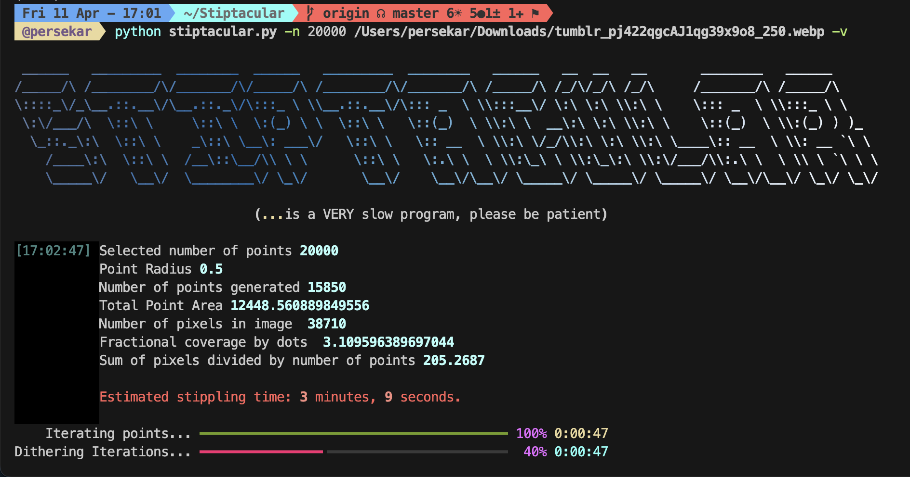

<!-- Improved compatibility of back to top link: See: https://github.com/othneildrew/Best-README-Template/pull/73 -->
<a id="readme-top"></a>
<!--
*** Thanks for checking out the Best-README-Template. If you have a suggestion
*** that would make this better, please fork the repo and create a pull request
*** or simply open an issue with the tag "enhancement".
*** Don't forget to give the project a star!
*** Thanks again! Now go create something AMAZING! :D
-->


<!-- PROJECT SHIELDS -->
<!--
*** I'm using markdown "reference style" links for readability.
*** Reference links are enclosed in brackets [ ] instead of parentheses ( ).
*** See the bottom of this document for the declaration of the reference variables
*** for contributors-url, forks-url, etc. This is an optional, concise syntax you may use.
*** https://www.markdownguide.org/basic-syntax/#reference-style-links
-->
[![Contributors][contributors-shield]][contributors-url]
[![Forks][forks-shield]][forks-url]
[![Stargazers][stars-shield]][stars-url]
[![Issues][issues-shield]][issues-url]
[![Unlicense License][license-shield]][license-url]


<!-- PROJECT LOGO -->
<br />
<div align="center">
  <h3 align="center">Stiptacular Next Gen</h3>

  <p align="center">
    Turn Images Into Stippled B&W
  </p>
</div>


<!-- ABOUT THE PROJECT -->


Remember how old scientific papers couldn't print in color in journals, so they did cool stippling and shit?

PERSEPHONE REMEMBERS

so anyway I found a project that converts images into stippled b&w and fixed it and am currently fixing it up to work with new versions of python + adding some features

<p align="right">(<a href="#readme-top">back to top</a>)</p>


<!-- GETTING STARTED -->
## Getting Started

### Installation

1. Clone the repo
   ```sh
   git clone --recursive https://github.com/pkarnstein-SI/Stiptacular.git
   ```
2. Install requirements
   ```sh
   python -m pip install -r requirements.txt
   ```

<p align="right">(<a href="#readme-top">back to top</a>)</p>


<!-- USAGE EXAMPLES -->
## Usage



Will write this later when i'm back on adderall

<p align="right">(<a href="#readme-top">back to top</a>)</p>


<!-- ROADMAP -->
## Roadmap


- [x] Update for Python3 and Shapely2
- [ ] Replace deprecated ``svgwrite`` dependency
- [ ] Auto-estimate parameters if you don't manually enter them
- [ ] Improve runtime estimate by fitting W.R.T. image size as well as number of points
- [ ] Implement OCR
    - [ ] Implement deep font detection

<p align="right">(<a href="#readme-top">back to top</a>)</p>

<!-- ## Star History

[](https://www.star-history.com/#pkarnstein-SI/Stiptacular&Date) -->


<!-- MARKDOWN LINKS & IMAGES -->
<!-- https://www.markdownguide.org/basic-syntax/#reference-style-links -->
[contributors-shield]: https://img.shields.io/github/contributors/pkarnstein-SI/Stiptacular?style=for-the-badge
[contributors-url]: https://github.com/othneildrew/Best-README-Template/graphs/contributors
[forks-shield]: https://img.shields.io/github/forks/pkarnstein-SI/Stiptacular?style=for-the-badge
[forks-url]: https://github.com/othneildrew/Best-README-Template/network/members
[stars-shield]: https://img.shields.io/github/stars/pkarnstein-SI/Stiptacular?style=for-the-badge
[stars-url]: https://github.com/othneildrew/Best-README-Template/stargazers
[issues-shield]: https://img.shields.io/github/issues/pkarnstein-SI/Stiptacular?style=for-the-badge
[issues-url]: https://github.com/othneildrew/Best-README-Template/issues
[license-shield]: https://img.shields.io/github/license/pkarnstein-SI/Stiptacular?style=for-the-badge
[license-url]: https://github.com/othneildrew/Best-README-Template/blob/master/LICENSE.txt
[linkedin-shield]: https://img.shields.io/badge/-LinkedIn-black.svg?style=for-the-badge&logo=linkedin&colorB=555
